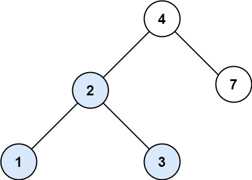

**[Search in BST](https://leetcode.com/problems/search-in-a-binary-search-tree/)**

Easy

You are given the root of a binary search tree (BST) and an integer val.

Find the node in the BST that the node's value equals val and return the subtree rooted with that node. If such a node does not exist, return `null`.

**Example 1:**

```
Input: root = [4,2,7,1,3], val = 2
Output: [2,1,3]
```

**Constraints:**

The number of nodes in the tree is in the range `[1, 5000]`.
- 1 <= Node.val <= 107
- root is a binary search tree.
- 1 <= val <= 107

#### Approach 1 - Recursive

#### Complexity

- Time complexity: O(log n)
- Space complexity: O(log n) // for stack

**code**
```javascript
var searchBST = function(root, val) {
    if (root === null) return null;

    if (root.val === val) return root;

    return searchBST(root.left, val) || 
           searchBST(root.right, val);
};
```

#### Approach 2 - Optimised Iterative

#### Complexity

- Time complexity: O(log n)
- Space complexity: O(1)

**Code**
```javascript
var searchBST = function(root, val) {
    
    while (root !== null && root.val !== val) {
        root = root.val > val ? root.left : root.right;
    }

    return root;
};
```